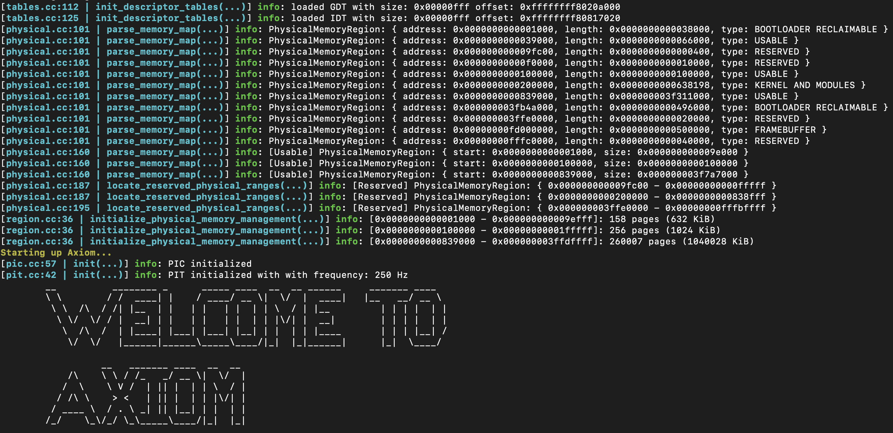
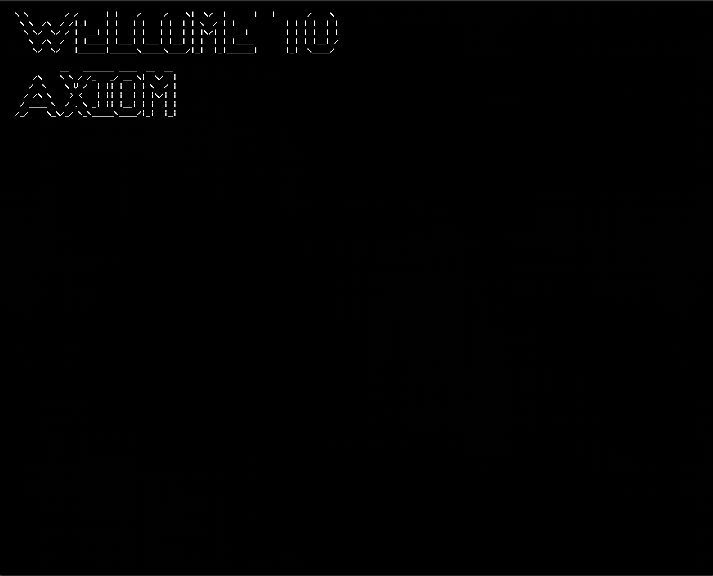

	

---

## To-Do List
- [ ] scheduler
- [ ] syscall interface
- [ ] IPC

---

## Build Requirements

You'll need `cmake` `make` `gcc` `xorriso` `qemu` and `mtools` (TODO: verify)

## Building Axiom
  * Clone the repo ***recursively*** (e.g. `git clone --recusive https://github.com/ErrorOnUsername/axiom.git`
  * Build the toolchain
    - `cd` into the `toolchain` directory
    - run `./build_toolchain.sh`
		- This should yank, unpack, and build everything. If it breaks, just open an issue and we'll figure it out :)
  * Build the kernel and iso
    - create a build directory in the root of the project and `cd` into it
    - run `cmake ..`
    - run `make && make run`
  * Now you're in axiom :D

## Latest Screenshot

